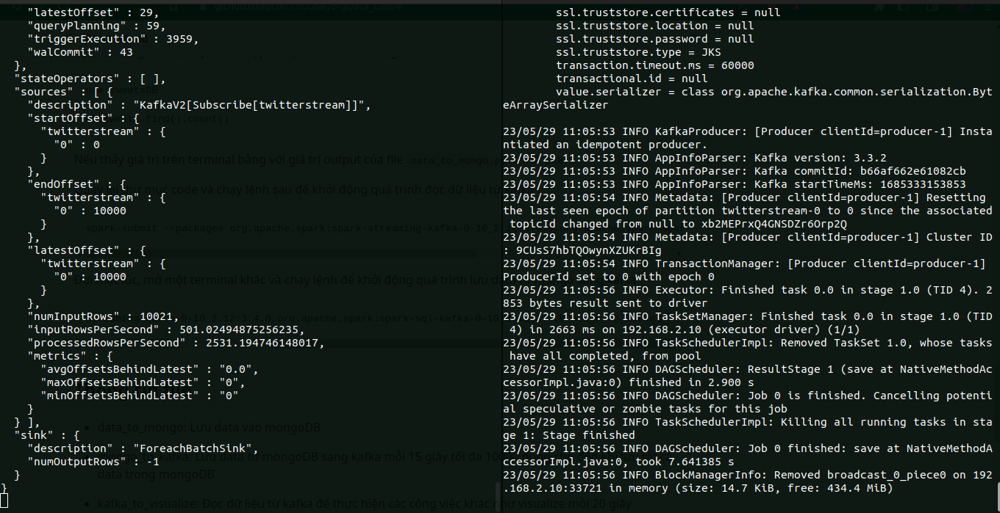
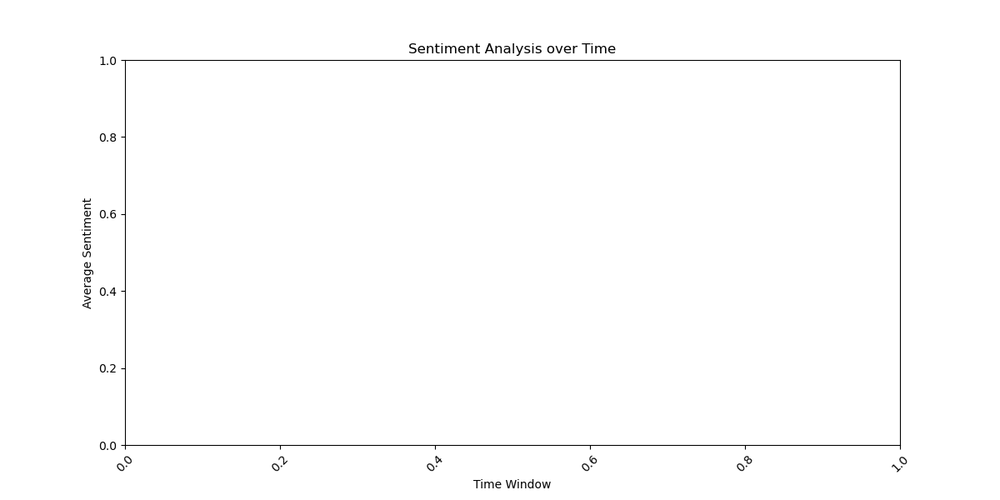
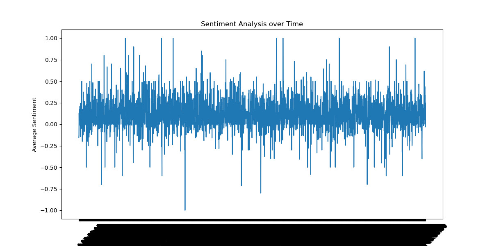
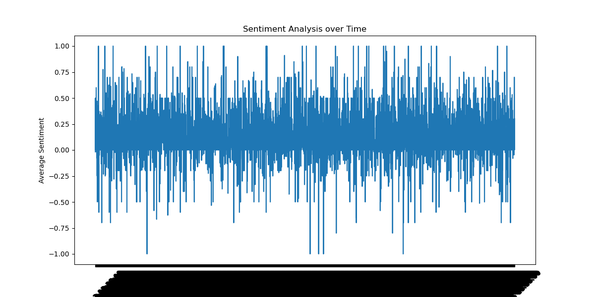

# Lab 04: Streaming Data Processing with Spark

## List of team members

| ID       | Full Name          | Completed |
| -------- | ------------------ | --------- |
| 20120366 | Pham Phu Hoang Son | 100%      |
| 20120391 | Ha Xuan Truong     | 100%      |
| 20120393 | Huynh Minh Tu      | 100%      |
| 20120468 | Nguyen Van Hai     | 100%      |

## Team's result

| Section                                | Point |
| -------------------------------------- | --------- |
| Get Twitter tweets                     | 1.5      |
| Stream tweets to Apache Spark          | 4      |
| Perform sentiment analysis on tweets   | 2      |
| Visualize the analytic results         | 2.5      |

## Team reflection

**Does your journey to the deadline have any bugs? How have you overcome it?**

While working on lab04, "Streaming Data Processing with Spark," I came across the following issues:

- Initially, I tried to run Streaming Data with Spark on Google Colab, but unfortunately, it didn't work as expected. As a result, our team made the decision to switch to running the Python file locally.

- Another challenge we faced was the slow performance and frequent errors during the streaming process. Whenever we ran the code, it only processed a single batch of data before encountering issues.

**What have you learned after this process?**

From the experience of working on lab04 and encountering the mentioned issues, several valuable lessons can be learned:

- Platform compatibility: It is important to consider the compatibility of the tools and platforms being used for the project. In this case, attempting to run Streaming Data with Spark on Google Colab resulted in compatibility issues. Therefore, it is crucial to thoroughly test and ensure that the chosen platform supports the required dependencies and functionalities.

- Local execution as an alternative: When facing challenges with a specific platform, having a backup plan or alternative approach is essential. In this situation, switching to running the Python file locally proved to be a viable solution. It is crucial to be adaptable and prepared to modify the execution environment to overcome obstacles and ensure progress.

- Performance optimization: The slow speed and frequent errors during the streaming process highlight the importance of performance optimization. Stream processing can be resource-intensive, and it is essential to analyze and fine-tune the code to improve efficiency. This may involve optimizing Spark configurations, leveraging appropriate data structures, or implementing parallel processing techniques.

- Error handling and resilience: When working with streaming data, it is crucial to anticipate and handle errors effectively. The fact that the code processed only a single batch of data before encountering issues suggests the need for robust error handling mechanisms. This may involve implementing error monitoring, graceful failure handling, and appropriate error recovery strategies to ensure the stability and reliability of the streaming process.

- Continuous testing and debugging: Streaming data processing can be complex, and continuous testing and debugging are vital. It is important to regularly validate the code, test various scenarios, and closely monitor the system's behavior. Prompt identification and resolution of bugs and issues contribute to smoother and more reliable data processing.

## Get Twitter tweets

### Step 1: Download data from https://huggingface.co/datasets/deberain/ChatGPT-Tweets.

### Step 2: Download mongoDB in ubuntu.

    sudo apt-get install gnupg

    curl -fsSL https://pgp.mongodb.com/server-6.0.asc | \
    sudo gpg -o /usr/share/keyrings/mongodb-server-6.0.gpg \
    --dearmor

    echo "deb [ arch=amd64,arm64 signed-by=/usr/share/keyrings/mongodb-server-6.0.gpg ] https://repo.mongodb.org/apt/ubuntu jammy/mongodb-org/6.0 multiverse" | sudo tee /etc/apt/sources.list.d/mongodb-org-6.0.list

    sudo apt-get update

    sudo apt-get install -y mongodb-org

Run mongoDB in terminal:

    sudo systemctl start mongod

    sudo systemctl status mongod

### Step 3: Save tweets data to mongoDB by pymongo

Run file [data_to_mongo.py](../data_to_mongo.py) to save tweets data in mongoDB


## Stream tweets to Apache Spark

We using kafka to stream tweets from mongoDB to apache Spark.

### Step 1: Install Apache Spark.

Download Spark in this link: https://www.apache.org/dyn/closer.lua/spark/spark-3.4.0/spark-3.4.0-bin-hadoop3.tgz

Unzip and save to './Home'. Rename to Spark. Open terminal and run this command:

    nano ~/.bashrc

Add and replace username to user ubuntu

    export SPARK_HOME=/home/{username}/spark
    export PATH=$PATH:$SPARK_HOME/bin:$SPARK_HOME/sbin

Return Terminal and run:

    source ~/.bashrc

Add jars:

    cd $SPARK_HOME/jars && wget https://repo1.maven.org/maven2/org/mongodb/spark/mongo-spark-connector_2.12/10.1.1/mongo-spark-connector_2.12-10.1.1.jar

    cd $SPARK_HOME/jars && wget https://repo1.maven.org/maven2/org/mongodb/mongodb-driver/3.12.13/mongodb-driver-3.12.13.jar

    cd $SPARK_HOME/jars && wget https://repo1.maven.org/maven2/org/mongodb/mongo-java-driver/3.12.13/mongo-java-driver-3.12.13.jar

    cd $SPARK_HOME/jars && wget https://repo1.maven.org/maven2/org/mongodb/bson/4.9.1/bson-4.9.1.jar

### Step 2: Install kafka

Download Kafka in this link: https://downloads.apache.org/kafka/3.4.0/kafka_2.12-3.4.0.tgz

Unzip and add to '/Home'

Rename to Kafka

Open terminal and run:

    cd /home/{username}/Kafka

    bin/zookeeper-server-start.sh config/zookeeper.properties

Open new terminal and run:

    cd /home/{username}/Kafka

    bin/zookeeper-server-start.sh config/zookeeper.properties

Open new terminal and run this command to create a topic of Kafka:

    bin/kafka-topics.sh --create --topic twitterstream --bootstrap-server localhost:9092

    # verify
    bin/kafka-topics.sh --describe --topic twitterstream --bootstrap-server localhost:9092

### Step 3: Install some Python libraries

Open terminal and install some libraries

```
pip install datasets
pip install pymongo
pip install textblob
pip install findspark
```

### Step 4: Write data from mongoDB to kafka

- Firstly, we convert all columns to a struct column.

- Secondly,convert struct column to JSON and rename to "value"

- Lastly, We save tweets to kafka each 15 seconds with 10000 rows

You can find source code in file [mongo_to_kafka.py](../mongo_to_kafka.py) to see our step by step and get a deep understanding of how to write data to kafka.

Run file [mongo_to_kafka.py](../mongo_to_kafka.py) by command:

    spark -submit --packages org.apache.spark:spark-streaming-kafka-0-12_2:3.4.0,org.apache.spark:spark-sql-kafka-0-10_2.12:3.4.0 mongo_to_kafka.py

### Step 5: Streaming data

ou can find source code in file [kafka_to_visualize.py](../kafka_to_visualize.py) to see our step by step and get a deep understanding of how to streaming data by spark.

Run file [kafka_to_visualize.py](../kafka_to_visualize.py) by command:

    spark -submit --packages org.apache.spark:spark-streaming-kafka-0-12_2:3.4.0,org.apache.spark:spark-sql-kafka-0-10_2.12:3.4.0 kafka_to_visualize.py

Command to run two file [mongo_to_kafka.py](../mongo_to_kafka.py) and [kafka_to_visualize.py](../kafka_to_visualize.py):


Results after running:



## Perform sentiment analysis on tweets

The `sentiment(res_df)` function takes a DataFrame, performs text cleaning on the "Tweet" column, performs sentiment analysis, classifies the sentiments based on defined thresholds, and returns the updated DataFrame with sentiment labels and the original DataFrame for visualization purposes.

Sets the positive and negative thresholds for sentiment classification. Tweets with a sentiment score greater than `positive_threshold = 0.2` are classified as "positive", and tweets with a sentiment score less than `negative_threshold = -0.2` are classified as "negative". Tweets within the threshold range are classified as "neutral".

## Visualize the analytic results

The `visualize_batch()` function takes a batch DataFrame, performs sentiment analysis on it using the sentiment function, aggregates the sentiment values over time windows, creates a line plot of the average sentiment values, and saves the plot as an image file. This function can be used iteratively for each batch of data to visualize and save sentiment analysis results over time.

Print out the average sentiment tweets over a period (in this case is 1 minute)

Results after running:








## References

<!-- References without citing, this will be display as resources -->

- https://spark.apache.org/docs/latest/structured-streaming-kafka-integration.html
- https://kafka.apache.org/documentation/
- https://sparkbyexamples.com/spark/spark-streaming-with-kafka/?utm_content=expand_article
- https://matplotlib.org/stable/gallery/index.html

<!-- References with citing, this will be display as footnotes -->

<!-- [^fn1]:
    So Chris Krycho, "Not Exactly a Millennium," chriskrycho.com, July 2015, http://v4.chriskrycho.com/2015/not-exactly-a-millennium.html
    (accessed July 25, 2015)

[^fn2]: Contra Krycho, 15, who has everything _quite_ wrong.
[^fn3]: ibid -->
